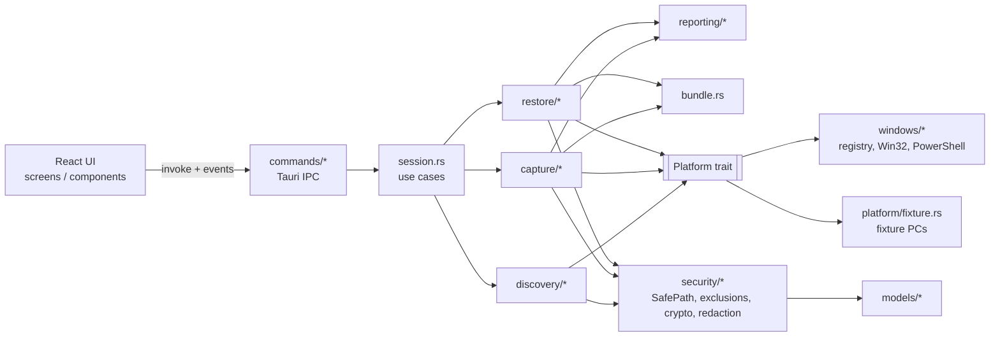
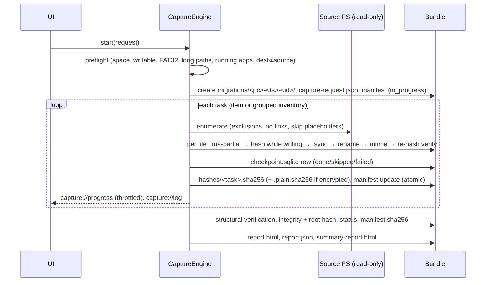

# Architecture

Migration Assistant is a Tauri 2 desktop application. All domain logic lives in a Rust **library crate** (`migration_assistant_lib`) that compiles and is fully tested without Tauri or a WebView (`--no-default-features`). The Tauri shell, enabled by the `desktop` feature, is a thin IPC layer. The React UI talks to it through a typed `Backend` interface, which a browser-only mock also implements.

Dependencies point inward only. `models`, `security` and `util` know nothing about discovery, capture or Tauri.

## Layers and modules

| Layer | Module | Responsibility |
|---|---|---|
| Presentation | `src/` (React) | Screens, accessibility, and progress rendering. It makes no decisions about safety: the backend enforces every rule. |
| IPC | `src-tauri/src/commands/` | One file per area (app, scan, capture, restore). Commands deserialize the request, run blocking work on the async runtime's blocking pool, and forward progress as events. |
| Use cases | `session.rs` | Holds the current scan and opened bundle, enforces the authorization gate, validates destinations and custom folders, deletes incomplete bundles (with a typed ID), writes restore instructions, and keeps the bundle index. |
| Domain services | `discovery/`, `capture/`, `restore/`, `reporting/`, `bundle.rs` | The engines (see below). |
| Adapters | `platform/` (`Platform` trait, fixture adapter, sysinfo helpers), `windows/` | All OS access: registry, Win32, PowerShell PrintManagement and processes. |
| Foundations | `models/`, `security/`, `fs_walk.rs`, `progress.rs`, `util.rs`, `error.rs`, `app_paths.rs`, `index.rs` | Types, path safety, crypto, walking, logging/progress, atomic writes, portable paths, and the SQLite index. |

## Core domain models (`src-tauri/src/models`)

- **`DiscoveryItem`**: one selectable row. It has `id` (deterministic), `category`, `display_name`, `source` (path or config reference), `owner` (`UserRef`: SID and account), `estimated_size` / `item_count` (where `None` means unknown, never zero), `access`, `support` (`Supported | Partial | InventoryOnly | Unsupported`), `selected_by_default`, `sensitive`, `opt_in_only`, `requires_admin`, `warnings`, `restore_notes`, `includes` / `excludes`, `restore_kind`, and `payload`.
  - The **payload** (`Folder | AllowList | FilesByExtension | Files | Inventory | None`) stays on the backend. The UI selects by ID only, so it can never inject a capture path. The one exception, custom folders, goes through `SafePath` and the exclusion rules.
- **`ScanResult`** holds the machine, users, items and the printer/drive/app/browser inventories, plus warnings and the platform label.
- **`Manifest`** (schema `1.0`) is the capture ↔ restore contract: source machine, encryption metadata (never secrets), users, `ManifestItem`s (bundle path, profile-relative path, restore kind, hash list and digest, capture status), inventories, capacity, integrity, exclusions and `restore_history`. Field reference: [docs/MANIFEST_SCHEMA.md](docs/MANIFEST_SCHEMA.md).
- **`TaskProgress`**: a per-task snapshot with `state` (`queued → scanning → copying → verifying → completed | completed_with_warnings | skipped | failed | canceled`), bytes and items, rate, an ETA that is `None` when not meaningful, warnings, retries and error.
- **`RestorePlan` / `RestoreAction` / `SystemChange`**: the dry run. Each action names its target path, file and conflict counts, policy, admin requirement, block reason, and the exact system changes (`RegistryValue`, `MapDrive`, `ConnectSharedPrinter`, `AddNetworkPrinter`, `ManualChecklist`).

The TypeScript mirrors are in `src/lib/types.ts`.

## Platform abstraction

`Platform` (in `platform/mod.rs`) is the only way the engines touch the OS: machine info, elevation, system roots, profiles, known folders, AppData roots, the Public Desktop, OneDrive roots, installed apps, printers, mapped drives, processes, disk space, wallpaper, Outlook profile names, the long-paths flag, and the restore side effects (map drive, printers, wallpaper, restart elevated, open folder).

- **`WindowsPlatform`** uses `winreg` for ProfileList, the Uninstall keys (64-bit, 32-bit and per-user), `HKCU\Network`, User Shell Folders, `LongPathsEnabled`, TimeZone and CloudDomainJoin. It uses Win32 (`windows-sys`) for token elevation, `LookupAccountSidW`, `NetGetJoinInformation`, `GetLogicalDrives`, `WNetGetConnectionW`, `WNetAddConnection3W` (with `CONNECT_INTERACTIVE`, so Windows shows its own credential prompt), `SystemParametersInfoW` and `ShellExecuteW("runas")`. `sysinfo` provides CPU, RAM, disks, adapters and processes. **PowerShell** is used only for `Get-Printer`, `Get-PrinterPort` and `Get-PrinterDriver` (and `Add-Printer` / `Add-PrinterPort` on a confirmed restore), with constant scripts fed on stdin and all values passed through `MA_*` environment variables, so nothing is interpolated into script text.
- **`FixturePlatform`** reads `fixtures/<pc>/platform.json` plus real directory trees and records side effects in a journal. Test seams let it simulate locked files and low disk space.

**Decision.** A trait plus a fixture adapter, rather than conditional compilation inside the engines, means every engine path is exercised on any OS in CI, and the UI can be developed without admin rights or real profiles.

## Discovery

`DiscoveryService` runs `DiscoveryModule`s in stages and emits `ScanProgress`. One failing module adds a warning instead of aborting the scan. The modules are: system inventory, profile notes, user folders, desktop & shortcuts, browsers, Outlook, personalization, printers, network drives, installed apps, and settings plug-ins.

- **Item IDs are deterministic** (`module:owner-sid:key`), so a rescan keeps the selection and a resumed capture maps checkpoints onto the same items.
- **Default selection policy** (`apply_default_selection`): supported, readable, not sensitive, not opt-in, and owned by the current user or the machine.
- **Measurement** uses the shared `fs_walk` walker, which never follows links or junctions (it uses `symlink_metadata` with name-surrogate reparse detection), never opens file content (so cloud placeholders are not hydrated), counts access-denied entries, and applies the exclusion rules.
- **`BrowserProvider`** (`discovery/browsers.rs`): `kind`, `display_name`, `process_names`, `profile_roots`, `enumerate_profiles`, `allow_list`, `supported_components` / `excluded_components`, `restore_notes`, and `preflight`. The implementations are Chrome, Edge, Firefox (via profiles.ini) and a generic Chromium provider created only from a technician-confirmed "User Data" root inside the user's profile. Profile display names come from `Preferences` → `profile.name` only. `Local State`, which holds the os_crypt key, is never read.
- **Settings plug-ins** (`discovery/plugins.rs`) are declarative: app ID, versions, discovery paths relative to AppData, included settings, excluded sensitive data, compatibility notes, and capture/restore strategy. They are opt-in, and there is no generic registry scraping.

## Capture pipeline

- **Integrity strategy**, recorded verbatim in each manifest: per-file SHA-256 of the stored bytes, hashed during the write and re-read after it. Each module gets a `sha256sum`-compatible list, which can be checked with `sha256sum -c` or `Get-FileHash`. The manifest stores each list's digest and a **bundle root hash** over all digests in item order. `manifest.sha256` protects the manifest itself.
- **Resume**: `logs/checkpoint.sqlite` records every file (size, mtime, stored path and hashes). On resume, unchanged finished files are reused after re-verifying the stored bytes, and partial and skipped files are recopied. Completed tasks are skipped. Resume requires the same source computer and, if the bundle is encrypted, the passphrase.
- **Retries**: sharing and lock violations (Win32 32/33) are retried with exponential backoff, then skipped and reported (the default) or failed. A hash mismatch is retried once.
- **Truthful status**: `Verified` only if the structural verification passes, no task failed, no file failed (error-severity warnings), and there are no mismatches. Otherwise the status is `CompletedUnverified`. Cancellation gives `Canceled`, which is resumable.
- **Encryption**: Argon2id (64 MiB, t=3, p=1) derives a bundle key. Each file uses an HKDF-SHA256 subkey from a random 32-byte salt and AES-256-GCM STREAM (BE32) with a random 7-byte nonce prefix and 1 MiB chunks. Payload files get a `.maenc` suffix. The ciphertext hash lists allow verification without the passphrase, and the plaintext lists verify content after decryption.

## Restore pipeline

1. `open_bundle`: parse and validate the manifest (schema major version, UUID, every path checked with `safe_relative`, hash lists confined to `hashes/`, consistent encryption metadata), check `manifest.sha256`, **fully re-hash** every file, and require a verified capture status.
2. Target info and **default mappings**, matched by short account name, then display name, then the single-user fallback.
3. **Planning** writes nothing. Targets are resolved per `RestoreKind`: known folders through the target's (redirect-aware) known folder, AppData-relative paths for settings, `Migrated Files\...` for things without a natural home (OneDrive content, taskbar shortcuts, recent items, Firefox profiles, unknown custom folders). The planner counts conflicts, detects running browsers and Sticky Notes, checks admin needs, printer drivers and existing drive letters, and checks free space. Actions are sorted by `Category::restore_order()`: files, desktop, browsers (bookmark export first), Outlook, personalization, drives, printers, plug-ins.
4. **Execution** re-runs a quick structural verification, unlocks the key, and skips blocked actions and unconfirmed categories. It copies through a temp file and **only moves a file into place when its plaintext hash matches**. The replace policy renames the existing file to `name.pre-migration-<ts>.bak` and puts it back if the write fails. A file that appears during the restore is never overwritten.
5. A restore report is written (into the bundle, or the target user's Documents if the bundle is read-only), and a `RestoreEvent` is appended to the manifest.

**Bookmarks** are always exported as a Netscape bookmarks HTML file (from Chromium `Bookmarks` JSON or Firefox `places.sqlite` opened read-only), which any browser can import without touching an existing profile. `javascript:` and `data:` URLs are dropped.

## Security architecture (summary)

See [SECURITY.md](SECURITY.md) for details. In short:

- **SafePath**: canonicalization, a component-aware case-insensitive `is_within`, `safe_relative` (which rejects absolute paths, drive letters, UNC paths, `..`, ADS and control characters), `join_within`, Windows-safe name sanitization (including reserved names), and reparse/placeholder/EFS flags.
- **Exclusion rules**: system roots and their parents, page/hibernation/swap files, recycle bins, temp and caches, and a **sensitive list that cannot be overridden**: browser password, cookie, token, autofill and key files, Credential Manager, DPAPI, Vault, Crypto, Wi-Fi, registry hives, SSH/GPG keys, `.pfx/.p12/.ppk/.kdbx/.rdg`. Browser capture is additionally **allow-list based**.
- **Least-privilege Tauri capabilities** (`core:default` and `dialog:allow-open` only), a strict CSP, and no shell, fs, http or opener plugins.

## Portable data paths

`app_paths::resolve(exe)`: if the executable's folder is writable, data goes in `<exe>\MigrationAssistantData\` (created lazily) and the default destination is the exe folder. Otherwise there are no defaults: the technician picks a destination, which is kept only for the session unless they press **Save as default**, which writes `migration-assistant.config.json` beside the executable. Nothing goes to AppData. The SQLite **index** (`index.sqlite`) lists bundles seen by this copy of the app (paths, IDs and statuses only).

## UI architecture

- `App.tsx` is a small view state machine (`home → scan → dashboard → capture → complete`, plus `restore` and `report`) with context for the backend, status and notifications.
- `lib/api.ts` defines `Backend`. `TauriBackend` maps 1:1 onto the commands, and `MockBackend` replays `src/mocks/data/*.json`, which `scripts/build_mock_data.py` generates from a real fixture run.
- Accessibility: native inputs, Radix Dialog (focus trap), `role="progressbar"` with values, `aria-current` navigation, labelled controls, visible focus rings, reduced-motion support, and AA-contrast tokens for light and dark themes. Item rows are render functions rather than nested components, so keyboard focus survives re-renders.
- Overall progress is derived from task snapshots (`overall()` in `Capture.tsx`). It is byte-weighted when every total is known and task-count based otherwise, so the UI never claims more precision than it has.

## Key decisions

| Decision | Rationale |
|---|---|
| Library crate + `desktop` feature | Tests and the headless demo run anywhere, and the Tauri glue stays thin. |
| Inspectable directory bundle (not an opaque archive) | Technicians can browse, verify with standard tools and recover partially. ZIP export is left as an optional follow-up. |
| Per-file SHA-256 + module lists + root hash | Detects corruption at file granularity, allows `sha256sum -c`, and allows cheap structural checks. |
| SQLite checkpoints in the bundle | Scales to very large file counts, allows crash-safe resume, and keeps the payload directory clean. |
| Allow-lists for browsers and plug-ins | Safer than deny-lists: new browser secret stores are excluded by default. |
| Backend owns capture paths | The UI cannot be used to exfiltrate arbitrary paths. |
| Skip-existing default; replace keeps a `.bak` | Restore never destroys data. |
| PowerShell only for PrintManagement | It is the only clean, supported interface for printer details. Scripts are constants and data travels in environment variables. |
| No force-closing of applications | Respects user data. Locked files are retried, skipped and reported instead. |
| Mock backend from real fixture output | The UI preview always matches the real data shapes. |

## Extension points

- New browser: implement `BrowserProvider` and add it to `default_providers()`.
- New app settings: add a `SettingsPlugin` to `plugins::registry()` (declarative paths only) and a `RestoreKind` mapping if it needs a special target.
- New OS capability: add a method to `Platform` and implement it in both adapters, with the fixture behaviour documented.
- New inventory: add an `ItemPayload::Inventory { name }` producer and handle it in `Run::inventory_task`.
