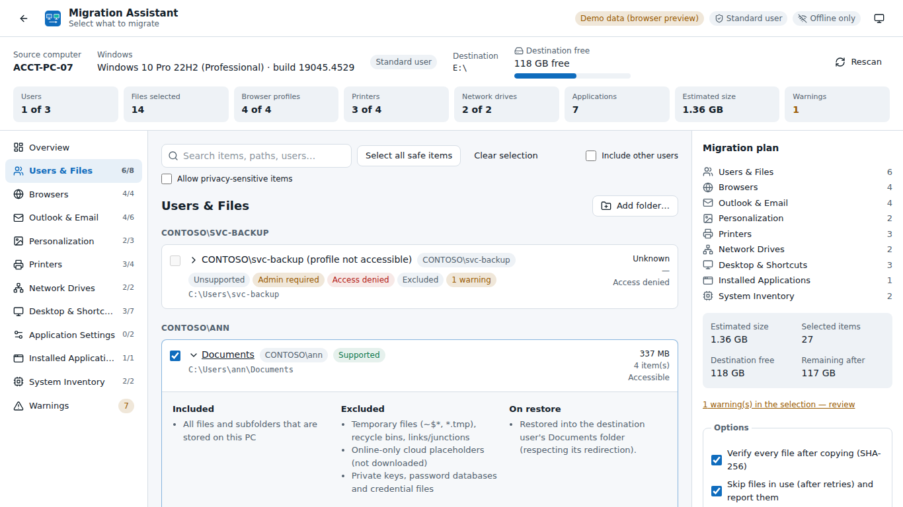
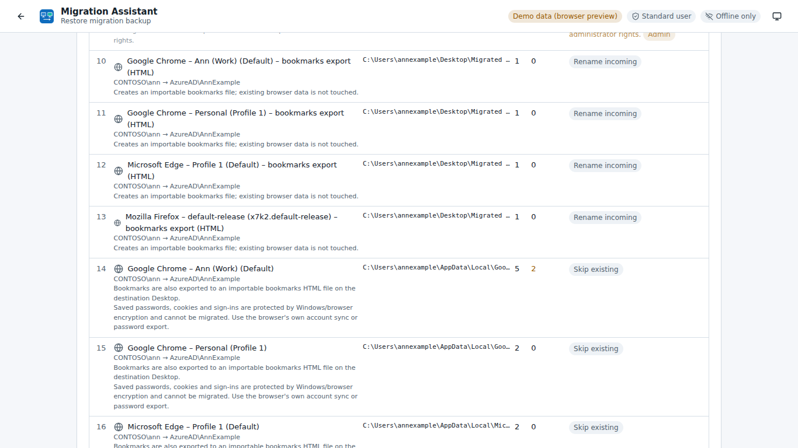
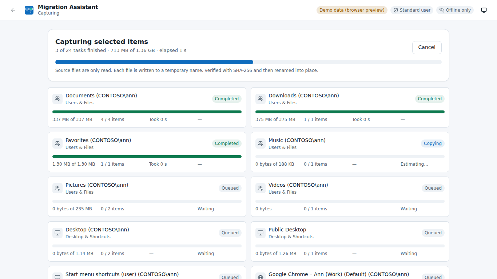
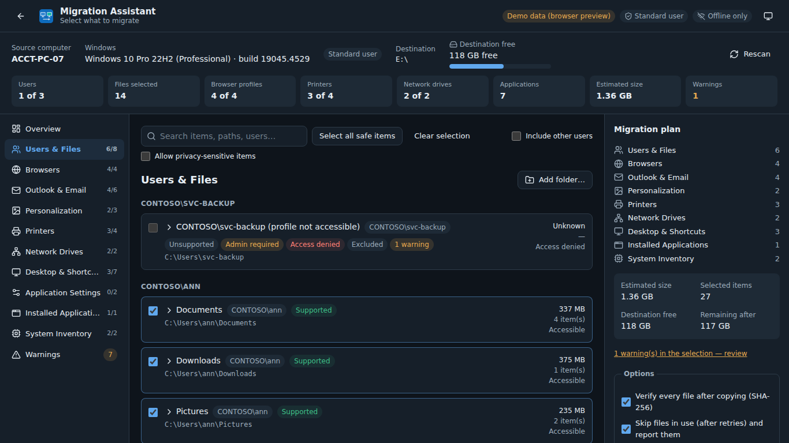

# Migration Assistant

A portable Windows tool for **authorized** PC-to-PC user profile migration. Run it from a USB drive on the old PC, select exactly what to keep, and write a **verified, resumable, human-readable bundle**. On the new PC, open the bundle, map users, review a **dry-run plan**, and restore. Everything is explained in clear reports.

> **Scope.** Migration Assistant only works on the computer where it runs. It has **no networking, no telemetry and no remote features**, and it **never** extracts passwords, cookies, tokens, Credential Manager entries, Wi-Fi keys, private keys or license keys. See [SECURITY.md](SECURITY.md) and [PRIVACY.md](PRIVACY.md).

| Selection dashboard | Restore dry-run plan |
|---|---|
|  |  |
|  |  |

More screenshots are in [`docs/screenshots/`](docs/screenshots). They come from the browser preview, which replays real fixture data and is labelled "Demo data".

---

## Features

| Area | What it does |
|---|---|
| **Portable** | A single `MigrationAssistant.exe` (Tauri 2 + WebView2) with no installer, service, Node.js or Python. App data lives in `<exe folder>\MigrationAssistantData\` when that folder is writable, and never silently in AppData. |
| **Discovery** | Staged, read-only scan: computer inventory, local profiles (SID → account, last use with confidence), known folders (OneDrive-aware), browsers (Chrome, Edge, Firefox, plus a confirmed generic Chromium root), Outlook (signatures, templates, stationery, PST opt-in, OST shown but excluded), wallpaper, themes, slideshow folders, Sticky Notes, desktops and shortcuts, printers, mapped drives, installed apps and settings plug-ins. |
| **Selection** | Category navigation, search on every list, status chips (Supported / Partial / Inventory only / Admin required / Locked / Excluded / Warning), and an item details pane listing exactly what is included and excluded. Has "Select all safe items" and "Clear selection". Risky, privacy-sensitive and opt-in items are never preselected. |
| **Capture** | Preflight checks (space, writability, FAT32, long paths, running apps), per-task progress with throughput and an honest ETA, cancellation and **safe resume** from SQLite checkpoints, and temp-file + atomic rename. Every file is **SHA-256 verified**, timestamps are preserved, and the source is never modified. |
| **Encryption (optional)** | AES-256-GCM (STREAM, 1 MiB chunks) with Argon2id key derivation, a random salt and nonce per file, and a key check. The passphrase is never stored or logged. |
| **Restore** | Integrity is verified before anything is shown and again before writing. You map users, get a dry-run plan in dependency order, choose a collision policy (**Skip existing** by default, **Rename incoming**, or **Replace** with a `.bak` copy after an extra confirmation), and confirm per category. Exact registry values, drive mappings and printer changes are shown first. |
| **Reports** | Technician HTML, machine-readable JSON, and a **redacted** summary for end users. Restore reports are added, and every restore is appended to the manifest history. |
| **Elevation** | Runs as a standard user and backs up your own data. Admin-only items are marked, and "Restart elevated" uses the normal UAC prompt. ACLs are never bypassed. |

## Repository layout

```text
.
├── src/                     React + TypeScript UI (Vite, Tailwind, shadcn-style components)
│   ├── components/          ui.tsx (primitives), domain.tsx (task cards, chips, log drawer)
│   ├── screens/             Home, SourceScan, Dashboard, Capture, Completion, RestoreWizard, ReportViewer
│   ├── lib/                 api.ts (Tauri/mock backend), types.ts, format.ts, selection.ts
│   └── mocks/               Browser-preview backend + data generated from a real fixture run
├── src-tauri/               Rust backend (library + Tauri shell)
│   └── src/
│       ├── models/          Typed domain models (discovery, manifest, capture, restore)
│       ├── discovery/       DiscoveryModule implementations, BrowserProvider, settings plug-ins
│       ├── capture/         Engine, preflight, verified copier, hashing, SQLite checkpoints
│       ├── restore/         Planner/executor, collision policies, bookmarks HTML export
│       ├── reporting/       Technician/summary HTML, JSON, restore reports
│       ├── security/        SafePath, exclusion rules, encryption, redaction
│       ├── platform/        Platform trait, fixture adapter, sysinfo helpers
│       ├── windows/         Windows adapter (registry, Win32, PowerShell PrintManagement)
│       ├── commands/        Thin Tauri IPC commands + event forwarding
│       ├── session.rs       Use-case layer behind the commands (headless-testable)
│       └── bundle.rs        Bundle layout, manifest I/O, verification
├── fixtures/                Fake source and target PCs (with planted secrets that must never be copied)
├── tests/                   UI flow tests (Vitest + Testing Library)
├── scripts/                 Fixture/icon/mock-data generators, screenshots, Windows build & signing
├── docs/                    Manifest schema, testing, release, screenshots
├── ARCHITECTURE.md  SECURITY.md  PRIVACY.md  SAMPLE_MANIFEST.json
```

## Quick start (development)

Prerequisites: Node.js 20+, Rust 1.83+, and on Windows the [Tauri 2 prerequisites](https://v2.tauri.app/start/prerequisites/) (MSVC build tools and WebView2).

```bash
npm install

# 1) UI only, in a normal browser, using the labelled demo backend
npm run dev                       # http://localhost:1420

# 2) Desktop app against fixture data (any OS with WebView toolkits)
npm run tauri:dev:fixture         # = tauri dev -- -- --fixture ../fixtures/source-pc

# 3) Desktop app against the real PC (Windows)
npm run tauri dev

# Headless end-to-end demo: scan → capture → restore with fixtures, no WebView needed
cd src-tauri
cargo run --no-default-features --example fixture_demo -- ../fixtures/source-pc /tmp/usb /tmp/target-copy
```

Fixture mode also starts with `MigrationAssistant.exe --fixture <dir>` or `MIGRATION_ASSISTANT_FIXTURE=<dir>`. The UI then shows a **Fixture mode** badge and every system change is only recorded, never applied.

## Tests

```bash
npm run test:all                 # typecheck + Vitest UI tests + all Rust tests
npm test                         # Vitest only
cd src-tauri && cargo test --no-default-features   # Rust unit + integration tests (no WebView required)
```

The Rust suite (83 tests) runs the real engines against the fixture PCs. It covers secret exclusion (passwords, cookies, tokens, credential stores, Wi-Fi, private keys, OS files), interrupted capture → resume, tamper and hash-mismatch detection, low-space blocking, locked-file retry/skip, malformed-manifest rejection, encryption round trips, the dry run writing nothing, collision policies, the confirmation gating, and the session flows. See [docs/TESTING.md](docs/TESTING.md).

## Building the portable release

On Windows (x64):

```powershell
.\scripts\build-portable.ps1                    # npm ci, tests, tauri build --no-bundle, package
.\scripts\build-portable.ps1 -WebView2FixedRuntime C:\path\to\Microsoft.WebView2.FixedVersionRuntime.x64
.\scripts\sign-windows.ps1 -Path dist-portable\MigrationAssistant\MigrationAssistant.exe -Thumbprint <cert>
```

Output goes to `dist-portable\MigrationAssistant\`: the executable, a README, `SHA256SUMS.txt`, and optionally a fixed WebView2 runtime. Copy the folder to a USB drive. See [docs/RELEASE.md](docs/RELEASE.md) for WebView2 options, code signing and reproducibility notes.

## Using it

1. **Create migration backup.** Confirm authorization, choose the destination (it defaults to the USB folder beside the executable), and run the scan.
2. **Select.** Review each category. Open an item to see exactly what is included and excluded, then use **Select all safe items** or pick items one by one.
3. **Start backup.** The preflight lists open apps (Migration Assistant never force-closes them), space and file-system checks. Progress is shown per task, and capture can be cancelled and resumed.
4. **Completion.** Open the bundle folder, the reports, or "Prepare restore instructions".
5. **Restore** on the new PC. Open the bundle, which is verified first, then enter the passphrase if it is encrypted, map users, choose items and collision policies, review the dry run, confirm categories, and restore. Finally, review the restore report.

## Explicit limitations

- **Windows 10/11 x64 only** for real (non-fixture) use. The WebView2 runtime must be present; it ships with Windows 11 and current Windows 10. Otherwise bundle a fixed runtime (docs/RELEASE.md).
- **No protected secrets, by design:** saved passwords, cookies, sign-ins, autofill/payment data, Credential Manager, DPAPI keys, Wi-Fi keys, certificates with private keys (`.pfx/.p12` are excluded), SSH/GPG keys and license keys are not migrated. Users should use browser/account sync or vendor export tools.
- **Applications are not migrated**, only inventoried. A reinstall checklist is produced.
- **Online-only cloud files** (OneDrive placeholders) are skipped and never downloaded.
- **Start menu layout, taskbar pins and Quick Access** are best effort. Pins are delivered as shortcut files, and the Quick Access list file format is undocumented.
- **Other users' profiles:** reading them on the source, or restoring into them, usually requires running elevated. The registry-based redirection of their known folders cannot be read without loading their hive, so default profile locations are assumed. Wallpaper is applied only for the signed-in user.
- **Printers:** drivers are never installed or copied. TCP/IP printers are recreated only when a compatible driver is already present and the app is elevated. USB/local printers produce a checklist.
- **Mapped drives** are recreated for the signed-in user. Windows prompts for credentials, and none are stored.
- **Encryption** covers file contents. File names, sizes and the inventory in the manifest stay readable so a bundle can be inspected and verified without the passphrase.
- **Locked files** (open in another app) are retried and then skipped and reported. There is no Volume Shadow Copy support in this MVP.
- **FAT32 destinations** cannot hold files of 4 GB or more; such files are skipped with a warning. Use NTFS or exFAT.
- **EFS-encrypted files** are read as the owning user and stored in the bundle without EFS. Enable bundle encryption to keep them protected at rest.
- Long-path support is handled internally, but other apps on the destination may not open paths of 260 characters or more unless Windows long paths are enabled.
- The Windows adapter is compiled and type-checked in CI on the Windows target. Behaviour on real hardware depends on Windows version and policy, so every such adapter degrades gracefully, with a visible warning.

## License

MIT. See the package metadata. Third-party licenses belong to their respective projects.
